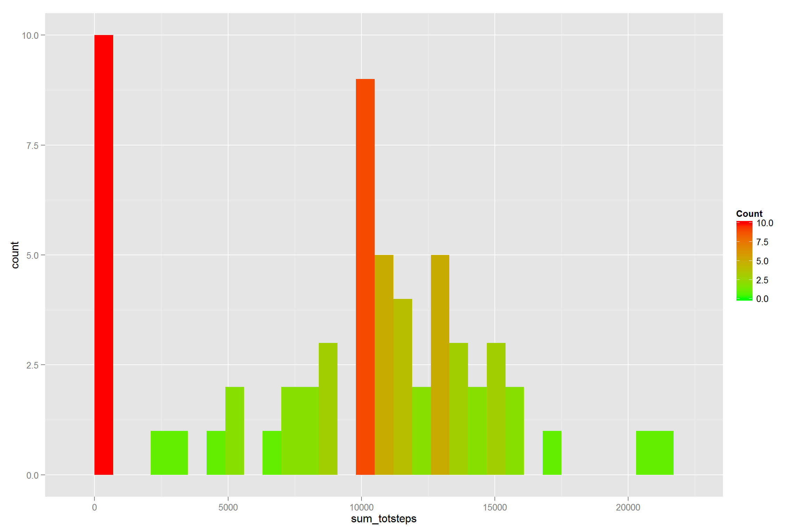
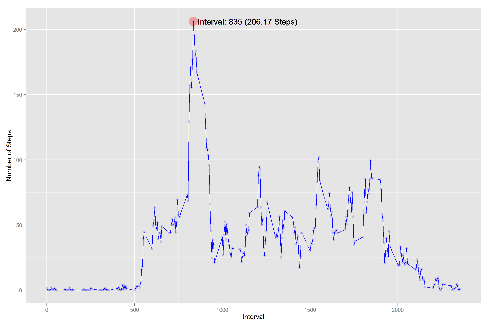
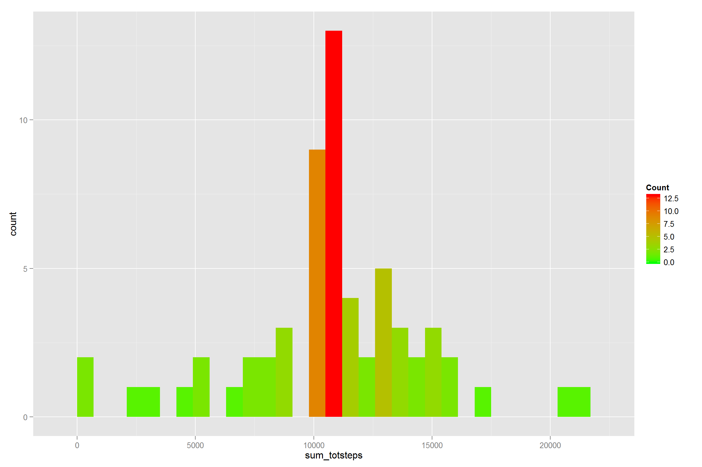
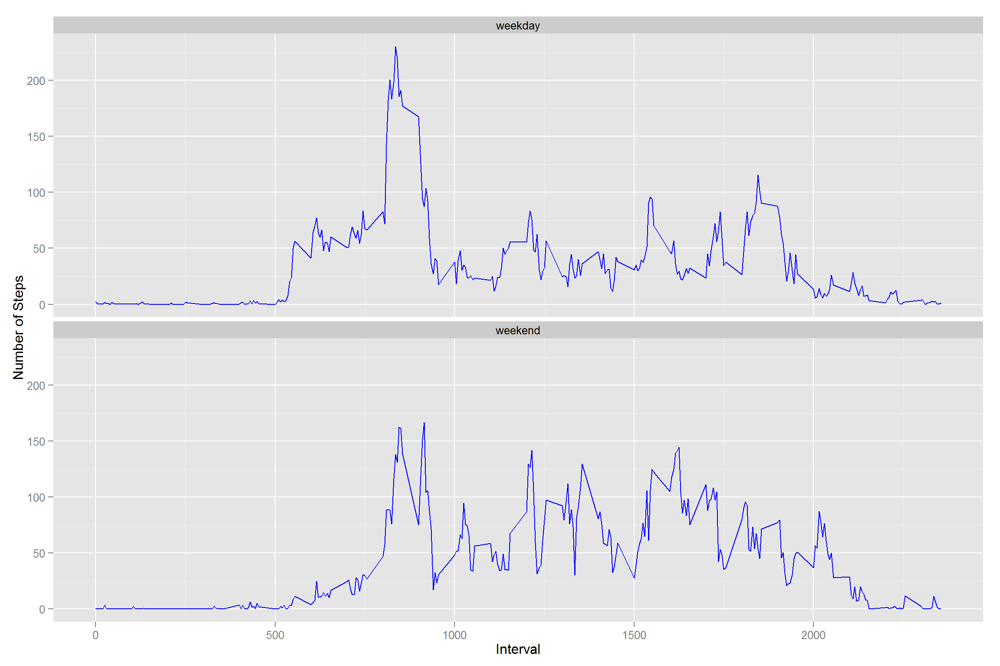

---
output: 
  html_document:
    keep_md: true
--- 
#<span style="color:rgba(158, 162, 163, 1);">Reproducible Research</span>
Peer Assessment 1  
by **Ricardo Delamar Roque**  
May 2015

###Required Packages for this Assignment


```r
require(dplyr)
require(ggplot2)
require(lubridate)
```

###Loading and preprocessing the data
I've included code to check if the csv/zip files are available.


```r
# Files for this Project
zipfname <- "activity.zip"
sdset <- "activity.csv"

# Abort in case the subset was not found.
if( !file.exists(sdset) ) {
    message("[WARN] Dataset Not Found. Trying to get it from the original zip file")    
    if( !file.exists(zipfname) ) {
        # Could not find neither the file containing the dataset nor the original
        # zip, so stop execution.
        stop("[ERROR] Zip file Not Found. Check dir of execution.")
    } else {
        # Unpack the Zip File
        unzip(zipfname, exdir=".")
        if( !file.exists(sdset) ) {
            stop("[ERROR] Dataset Not Found in the Zip file.")
        }
    }
}

# - - - Good to go!

dset <- read.csv(sdset)
```

**dset** now contains the original dataset (all NA's included)

### What is mean total number of steps taken per day?
"*Part 1 of the Assignment*"


```r
# Group by 'date' and Summarize Number of Steps
d <- dset %>% 
    group_by(date) %>% 
    summarize(sum_totsteps = sum(steps, na.rm=TRUE))

# plot the Histogram
g <- ggplot(d, aes(x=sum_totsteps))

g + geom_histogram(aes(fill = ..count..), binwidth=700) + 
    scale_fill_gradient("Count", low = "green", high = "red")
```

 

```r
# Mean and Median of Total Steps per day
mean(d$sum_totsteps) 
```

```
## [1] 9354.23
```

```r
median(d$sum_totsteps)
```

```
## [1] 10395
```

###What is the average daily activity pattern?
"*Part 2 of the Assignment*"


```r
# Get rid of all NAs
# Group by 'interval'
# Calc the average number of steps for each 'interval'
d <- dset %>%
    filter(!is.na(steps)) %>%
    group_by(interval) %>%
    summarize(sum_totsteps = sum(steps, na.rm=TRUE),
              nro_of_days=n(),
              avg_totsteps = mean(steps, na.rm=TRUE))

m_y <- max(d$avg_totsteps)
m_x <- d[d$avg_totsteps >= m_y,]$interval

g <- ggplot(d, aes(interval, avg_totsteps))

g + geom_line(color="blue") + 
    geom_point(color="blue", alpha=0.2) + 
    labs(x="Interval", y="Number of Steps") + 
    geom_text(data = NULL, x=m_x+25, y = m_y, 
              label = paste("Interval: ",m_x," (",round(m_y,2)," Steps)", sep=""),
              hjust=0, vjust=0.5) + 
    annotate("point", x=m_x, y=m_y, 
             size = 8, colour="red", alpha=0.3)
```

 
Note that the interval **835** contains the maximum number of steps (**206.17**).

###Imputing missing values
"*Part 3 of the Assignment*"

Imputing Strategy taken: **Mean of the 5-minute interval**


```r
# Number of NA's in the dataset
sum(is.na(dset$steps))
```

```
## [1] 2304
```

```r
# Remove all NA's
# Calc the average Number of Steps for each Interval
# We will need this to impute the average (mean) where a NA appears
d <- dset %>%
    filter(!is.na(steps)) %>%
    group_by(interval) %>%
    summarize(avg_totsteps = mean(steps, na.rm=TRUE))

# Make a copy of the original dataset
# 'daux' will have the average number of steps for records with NA's
daux <- dset

# Replace All NA's with values taken from the average
# Not the smartest/fastest way, but it works!
for(i in 1:nrow(daux)) {
    if( is.na(daux$steps[i]) ){
        daux$steps[i] <- d[d$interval==daux$interval[i],]$avg_totsteps
    }
}

# Group by 'date'
# Summarize using records filled out with averages
d <- daux %>% 
    group_by(date) %>% 
    summarize(sum_totsteps = sum(steps))

# plot the Histogram
g <- ggplot(d, aes(x=sum_totsteps))

g + geom_histogram(aes(fill = ..count..), binwidth=700) + 
    scale_fill_gradient("Count", low = "green", high = "red")
```

 

```r
# Mean and Median of Total Steps per day
mean(d$sum_totsteps) 
```

```
## [1] 10766.19
```

```r
median(d$sum_totsteps)
```

```
## [1] 10766.19
```
The Histogram shows a small variation when we use records filled with the averages.

###Are there differences in activity patterns between weekdays and weekends?
"*Part 4 of the Assigment*"


```r
# Create column 'daytype' that specifies if 'date' is a weekday or weekend
# Transform the new field in a factor
# Group by 'interval' and 'daytype'
# Average the Total of Steps
d <- daux %>% 
    mutate(daytype=ifelse(wday(ymd(date)) %in% c(1,7),"weekend","weekday")) %>%
    mutate(daytype=as.factor(daytype)) %>%
    group_by(interval, daytype) %>%
    summarize(avg_totsteps = mean(steps))

g <- ggplot(d, aes(interval, avg_totsteps))

g + geom_line(color="blue") + 
    facet_wrap(~ daytype, nrow=2) + 
    labs(x="Interval", y="Number of Steps")
```

 
